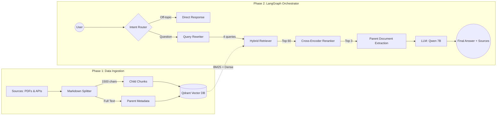

# Agentic Legal RAG : Assistant en Droit du Travail Français


-purple)


Un système RAG (Retrieval-Augmented Generation) conçu pour fonctionner **100% en local**  permettant de naviguer dans l'immense complexité du Droit du Travail Français. La base de données couvre le **Code du Travail**, le **Code de la Sécurité Sociale**, ainsi que **5 Conventions Collectives** majeures (*Syntec, Bâtiment, HCR, Automobile, Restauration Rapide*).

Ce projet démontre qu'il est possible d'obtenir un raisonnement juridique pointu sur du matériel grand public (Apple Silicon / MPS) à l'aide de LLMs locaux légers (ex: Qwen 7B), et ce, grâce à une orchestration multi-agents (LangGraph) et une manipulation intelligente des métadonnées.

## Innovations Clés

### 1. Extraction Parent-Document basée sur les Métadonnées
Les textes juridiques sont un cauchemar pour l'IA car un "Article" peut faire des milliers de mots. Le découper en petits morceaux détruit le contexte (syndrome du "Lost in the Middle"). 
**Solution :** Nous découpons le texte en petits segments (pour une recherche `BM25` + `Dense` ultra précise) mais injectons **l'intégralité de l'article de loi non fragmenté** dans les `metadata` de chaque segment. Lorsqu'une correspondance est trouvée, l'orchestrateur remplace le petit segment par le document parent complet avant de le transmettre au LLM. 
**Résultat :** Éradication totale des hallucinations liées à la perte de contexte.

### 2. Orchestration Multi-Agents (LangGraph)
Le chatbot fonctionne sur un graphe d'états strict :
- **Routeur d'Intention :** Différencie les salutations, les hors-sujets, les demandes de clarification et les questions juridiques pures.
- **Réécriture Contextuelle (Query Rewriting) :** Analyse l'historique et reformule la question en 4 requêtes de recherche distinctes, tout en conservant le jargon juridique critique (ex: "télétravail", "licenciement").
- **Détecteur de Changement de Sujet :** Vide dynamiquement l'historique s'il détecte un brusque changement d'intention, empêchant ainsi la "fuite de contexte" (Context Leakage) entre les recherches.

### 3. Recherche Multi-Étapes Locale (Hybride + CrossEncoder)
Recherche parmi une base vectorisée de plus de `30 000+` segments avec `Qdrant` :
- Extraction des `60` meilleurs résultats via un **Recherche Hybride** (Vecteurs denses `BAAI/bge-m3` + Matching de mots-clés Sparse BM25).
- Re-classement (Reranking) des résultats avec un **Cross-Encoder** (`cross-encoder/ms-marco-MiniLM-L-6-v2`) pour éliminer les articles sémantiquement proches mais juridiquement hors-sujet.
- Sélection du **Top 3 absolu** des "Parent Documents" pour alimenter le prompt du LLM.

##  Workflow Complet de l'Architecture



##  Installation & Utilisation

### Prérequis
- Installer Python 3.11+
- Installer les dépendances : `pip install -r requirements.txt` *(Note: inclut langchain, langgraph, qdrant-client, sentence-transformers, gradio, groq)*
- Télécharger **LM Studio** et y charger un modèle d'instructions 7B (ex: Qwen 2.5 7B Instruct) écoutant sur le port local `http://localhost:1234/v1`.

### 1. Ingestion des Données (Vectorisation)
Lancer le pipeline d'ingestion pour analyser les fichiers Markdown, formater les Parents Documents, et pousser les vecteurs vers l'instance Qdrant locale.
```bash
python ingest_db.py
```
*(Le script est optimisé pour Apple Silicon MPS. Les Batch sizes et les limites de mémoire sont configurés dans `configs.py` pour éviter les erreurs Out-of-Memory).*

### 2. Lancer l'Interface Conversationnelle
Démarrer l'interface utilisateur web servie par Gradio.
```bash
python app_langgraph.py
```

##  Évaluation (LLM-as-a-judge)

Système évalué via une batterie de tests stricte sur des contraintes juridiques complexes (*Pièges logiques, Raisonnement mathématique, Chronologie des processus, Conventions conflictuelles*). Nous utilisons l'API **Groq (Llama-3-70B)** comme évaluateur impartial (LLM-as-a-judge).

- **Framework d'évaluation :** `eval.py`
- **Score Actuel :** `33/55 (60.00% Zero-shot Accuracy)`
- **Analyse :**Pour un modèle local de 7B paramètres, les performances restent limitées, notamment sur des cas juridiques complexes en zéro-shot. Des améliorations sont attendues avec des modèles de plus grande taille ou mieux spécialisés.
Les erreurs résiduelles s’expliquent en partie par la forte densité lexicale des textes juridiques français, pouvant entraîner des confusions au niveau du reranking entre articles similaires.

##  Structure du Projet
- `configs.py` : Configuration système (Taille de chunk, chemins DB, variables LLM).
- `pdf_to_md.py` : Script de prétraitement puissant convertissant les volumineux PDFs des textes de loi en format Markdown structuré.
- `ingest_db.py` : Injection en base de données et manipulation des métadonnées juridiques.
- `fetch_api_ccn.py` : Scraper/Downloader traitant l'API de Légifrance pour assembler les Conventions Collectives.
- `test_vectorDB.py` : Script de test unitaire pour valider l'intégrité et le ciblage du Moteur de Recherche Vectoriel.
- `app_langgraph.py` : Le cœur de la machine d'états (LangGraph), le Retriever hybride et l'Interface Web Gradio.
- `eval.py` : Le cadre d'automatisation des tests de raisonnement pour l'évaluation empirique de performance.
- `evaluation_results.json` : Journaux détaillés des décisions et critiques rendues par le Juge LLM.