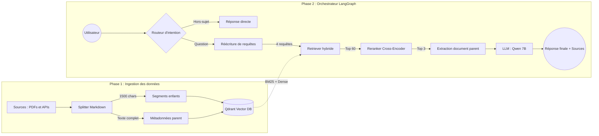

# French Labor Law RAG — Assistant Juridique Agentique


-purple)


Système **RAG (Retrieval-Augmented Generation)** de niveau production conçu pour naviguer dans la complexité du droit du travail français. Fonctionne **100% en local** sur du matériel grand public (Apple Silicon / MPS) avec des LLM légers.

La base de connaissances couvre le **Code du Travail**, le **Code de la Sécurité Sociale**, et **5 Conventions Collectives majeures** (*Syntec, Bâtiment, HCR, Automobile, Restauration Rapide*).

---

## Fonctionnalités

| Fonctionnalité | Description |
|---|---|
| **Ingestion de documents** | Pipeline automatisé : PDF → Markdown → Découpage → Vectorisation → Qdrant |
| **Recherche hybride** | Dense (BGE-M3) + Sparse (BM25) sur plus de 30 000 segments |
| **Reranking CrossEncoder** | Élimine les faux positifs avec un reranker basé sur CamemBERT |
| **Parent Document Retrieval** | Injecte le contexte complet de l'article via les métadonnées — zéro perte de contexte |
| **Orchestration agentique** | Workflow LangGraph : routage d'intention, réécriture de requêtes, détection de sujet |
| **Citations des sources** | Chaque réponse inclut les références aux articles et textes juridiques |
| **API REST** | Backend FastAPI avec validation Pydantic et documentation OpenAPI |
| **Interface web** | Interface Streamlit avec historique de conversation |
| **Conteneurisation** | Déploiement en une commande avec Docker Compose |
| **Évaluation** | Framework LLM-as-a-judge (Groq/Llama-3-70B) — 60% de précision zero-shot |

---

## Architecture



**Flux de données :** `ingestion → vectorisation → Qdrant → recherche → reranking → extraction parent → prompt → génération → réponse + citations`

---

## Stack technique

| Couche | Technologie |
|---|---|
| Langage | Python 3.11+ |
| Orchestration | LangGraph (machine à états multi-agents) |
| Base vectorielle | Qdrant (hybride dense + sparse) |
| Embeddings | BAAI/bge-m3 (dense) + BM25 (sparse) |
| Reranker | CamemBERT CrossEncoder (mmarcoFR) |
| LLM | Qwen 2.5 7B via LM Studio (local, privé) |
| API | FastAPI + Pydantic |
| Interface | Streamlit |
| Déploiement | Docker + Docker Compose |
| Évaluation | API Groq (Llama-3-70B comme juge) |

---

## Structure du projet

```
french-labor-law-rag/
│
├── app/
│   ├── api/
│   │   └── main.py              # Endpoints FastAPI (/health, /ask)
│   ├── core/
│   │   ├── config.py            # Pydantic BaseSettings (chargement .env)
│   │   └── logging.py           # Logging structuré
│   ├── rag/
│   │   ├── prompts.py           # Templates de prompts
│   │   ├── vectorstore.py       # Connexion Qdrant et embeddings
│   │   ├── ingest.py            # Pipeline d'ingestion (chargement → découpage → vectorisation)
│   │   ├── retriever.py         # Recherche hybride + reranking CrossEncoder
│   │   ├── generator.py         # Appel LLM + formatage des réponses
│   │   └── pipeline.py          # Orchestration LangGraph + ask_question()
│   ├── schemas/
│   │   └── qa.py                # Modèles Pydantic requête/réponse
│   └── utils/
│       ├── pdf_converter.py     # PDF → Markdown (PyMuPDF + Docling OCR)
│       └── legifrance_fetcher.py  # Scraper API pour les Conventions Collectives
│
├── ui/
│   └── streamlit_app.py         # Interface de démonstration
│
├── data/
│   ├── raw/                     # PDFs sources (gitignored)
│   └── processed/               # Fichiers Markdown structurés
│       ├── codes/
│       └── conventions/
│
├── tests/
│   ├── test_api.py              # Tests des endpoints FastAPI
│   ├── test_retriever.py        # Tests de recherche vectorielle
│   └── evaluation.py            # Évaluation LLM-as-a-judge
│
├── Dockerfile
├── docker-compose.yml
├── requirements.txt
├── .env.example
└── README.md
```

---

## Installation et utilisation

### Prérequis

- Python 3.11+
- [LM Studio](https://lmstudio.ai/) avec un modèle 7B (ex : Qwen 2.5 7B Instruct) sur `http://localhost:1234/v1`
- Docker (optionnel, pour le déploiement conteneurisé)

### 1. Installation

```bash
git clone https://github.com/LeVDuy/french-labor-law-rag.git
cd french-labor-law-rag

python -m venv .venv
source .venv/bin/activate

pip install -r requirements.txt

cp .env.example .env
# Éditez le fichier .env selon vos besoins
```

### 2. Démarrer Qdrant

```bash
docker run -d -p 6333:6333 -p 6334:6334 qdrant/qdrant
```

### 3. Ingestion des données (construction de la base de connaissances)

```bash
python -m app.rag.ingest
```

### 4. Lancer l'API

```bash
uvicorn app.api.main:app --reload --port 8000
```

Documentation disponible sur : `http://localhost:8000/docs`

### 5. Lancer l'interface

```bash
streamlit run ui/streamlit_app.py
```

### 6. Docker Compose (stack complète)

```bash
docker compose up --build
```

Services :
- **API** : `http://localhost:8000`
- **Qdrant** : `http://localhost:6333`
- **Interface** (optionnel) : `docker compose --profile ui up --build` → `http://localhost:8501`

---

## Exemple d'utilisation de l'API

### `POST /ask`

**Requête :**
```json
{
  "question": "Quels sont les droits du salarié en période d'essai ?"
}
```

**Réponse :**
```json
{
  "question": "Quels sont les droits du salarié en période d'essai ?",
  "answer": "Selon l'article L1221-19 du Code du travail...",
  "sources": [
    {
      "source": "Code du travail",
      "article": "Article L1221-19",
      "section": "Période d'essai",
      "content_preview": "..."
    }
  ],
  "intent": "[LEGAL_RAG]",
  "latency_ms": 4523.1
}
```

### `GET /health`

```json
{
  "status": "ok",
  "service": "french-labor-law-rag",
  "qdrant_connected": true
}
```

---

## Évaluation (LLM-as-a-judge)

Le système est évalué à l'aide d'une batterie stricte de 11 tests de raisonnement juridique (*pièges logiques, raisonnement mathématique, chronologies procédurales, conventions conflictuelles*). **Groq (Llama-3-70B)** sert de juge LLM impartial.

```bash
python -m tests.evaluation
```

- **Score actuel :** `33/55 (60.00% précision zero-shot)`
- **Analyse :** Pour un modèle local de 7 milliards de paramètres, les performances restent compétitives, en particulier sur les tests d'extraction directe et de logique conditionnelle. Les erreurs résiduelles proviennent du vocabulaire juridique dense qui provoque une confusion du reranking entre des articles similaires.

---

## Améliorations futures

- [ ] **Évaluation v2** — Élargir les tests avec du raisonnement multi-sauts et des questions ambiguës
- [ ] **Guardrails** — Filtres de sécurité entrée/sortie pour la production
- [ ] **Tableau de bord** — Grafana/Prometheus pour les métriques de requêtes et la détection de dérive
- [ ] **Reranker fine-tuné** — Entraîner un reranker CamemBERT sur des jeux de données de jugements juridiques français
- [ ] **Support multilingue** — Extension aux requêtes en anglais
- [ ] **RAG Fusion** — Reciprocal Rank Fusion entre plusieurs stratégies de recherche

---

## Décisions de conception clés

### 1. Stratégie de métadonnées Parent-Document
Le découpage standard détruit le contexte des articles. On découpe en petits segments pour une recherche précise, mais on stocke **l'article parent complet** dans les métadonnées. Lors de la recherche, l'orchestrateur remplace le segment enfant par le document parent complet avant la génération LLM. **Résultat :** Zéro hallucination par perte de contexte.

### 2. Routage d'intention agentique (LangGraph)
Le système utilise une machine à états stricte :
- **Routeur d'intention** — Différencie les salutations, le hors-sujet, les demandes de clarification et les questions juridiques
- **Réécriture contextuelle des requêtes** — Reformule en 4 requêtes de recherche tout en préservant le jargon juridique
- **Détection de changement de sujet** — Efface dynamiquement l'historique lors d'un changement de sujet pour éviter les fuites de contexte

### 3. Priorité au local et à la confidentialité
Toute l'inférence s'exécute sur l'appareil via LM Studio. Aucune donnée ne quitte la machine de l'utilisateur. Essentiel pour les cas d'usage juridiques où la confidentialité est primordiale.